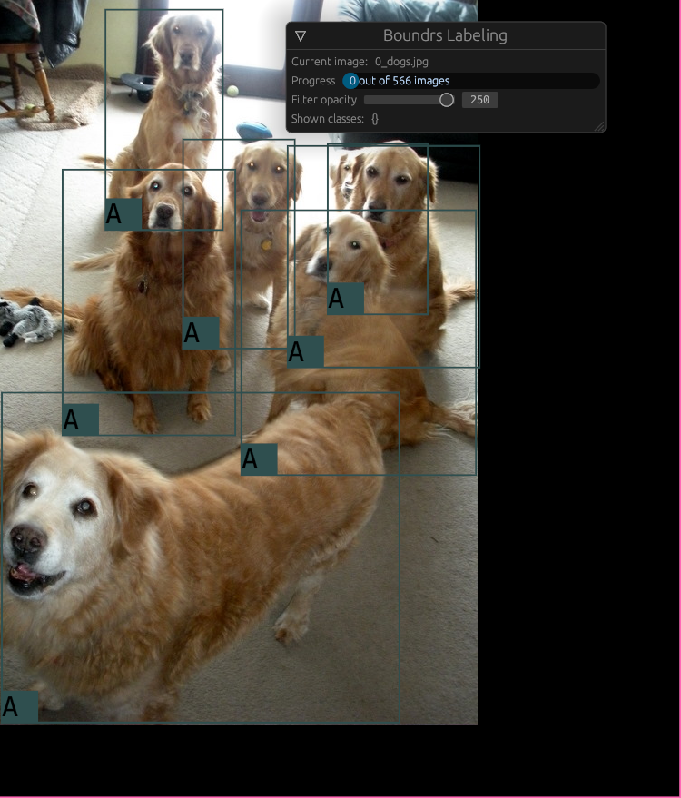

# Boundrs

A bounding box labeling tool.

## Features
- Currently it supports only the Yolo label format
- Uses the file system as storage, so it is always in sync with the disk
- Delete bounding boxes with right click
- Drag or click twice to make a bounding box
- Add a mask to highlight certain classes
- Customize your classes in the code easily and with type checking
- Built with egui so we get 60fps

## Screenshot

